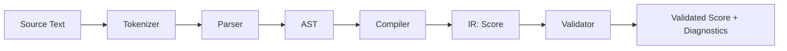
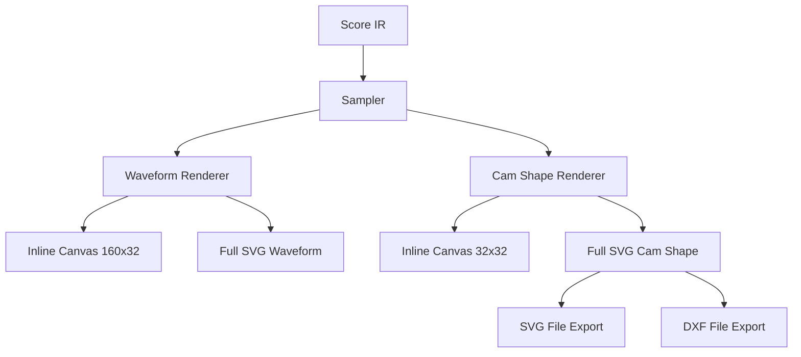
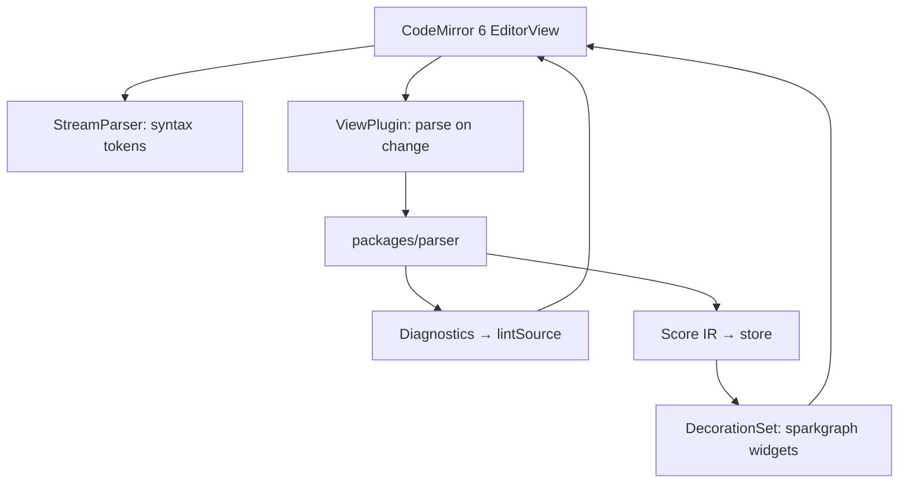

# StrokeScript — Architecture

**Status:** Proposed · v0.1 MVP

---

## 1. Directory Structure

```
strokescript/
├── spec/
│   ├── STROKE_SIGNATURE_SPEC.md        ← notation spec (primary artifact)
│   └── STROKE_SIGNATURE_EDITOR.md      ← editor design doc
│
├── packages/
│   ├── parser/                         ← standalone parser package
│   │   ├── src/
│   │   │   ├── index.ts                ← public API: parse, validate
│   │   │   ├── tokenizer.ts            ← lexer → token stream
│   │   │   ├── ast.ts                  ← AST node types
│   │   │   ├── parser.ts               ← recursive descent → AST
│   │   │   ├── ir.ts                   ← IR types (Segment, Voice, Score)
│   │   │   ├── compiler.ts             ← AST → IR (resolve refs, expand repeats, assign arcs)
│   │   │   ├── validator.ts            ← continuity checks, seam validation
│   │   │   ├── curves.ts               ← curve math (sine, bezier, linear, etc.)
│   │   │   └── errors.ts               ← structured error types with source positions
│   │   ├── __tests__/
│   │   │   ├── tokenizer.test.ts
│   │   │   ├── parser.test.ts
│   │   │   ├── compiler.test.ts
│   │   │   ├── validator.test.ts
│   │   │   └── curves.test.ts
│   │   ├── package.json
│   │   ├── tsconfig.json
│   │   └── vitest.config.ts
│   │
│   └── editor/                         ← Vite + React app
│       ├── src/
│       │   ├── main.tsx                 ← entry point
│       │   ├── App.tsx                  ← root layout
│       │   │
│       │   ├── codemirror/             ← CM6 integration layer
│       │   │   ├── language.ts          ← StreamParser for syntax highlighting
│       │   │   ├── decorations.ts       ← inline sparkgraph widget decorations
│       │   │   ├── linting.ts           ← parser errors → CM6 diagnostics
│       │   │   └── theme.ts             ← editor theme (segment colour tokens)
│       │   │
│       │   ├── renderer/               ← visualization engines
│       │   │   ├── waveform.ts          ← Canvas-based waveform drawing
│       │   │   ├── cam-shape.ts         ← Canvas-based polar cam drawing
│       │   │   ├── waveform-expanded.tsx ← SVG full-size waveform component
│       │   │   ├── cam-expanded.tsx      ← SVG full-size cam shape component
│       │   │   ├── sampler.ts           ← Score IR → sample points (shared)
│       │   │   └── palette.ts           ← curve-type colour map
│       │   │
│       │   ├── components/             ← React UI
│       │   │   ├── EditorPane.tsx        ← CodeMirror wrapper + sparkgraph injection
│       │   │   ├── HeaderBar.tsx         ← score metadata display/edit
│       │   │   ├── TransportBar.tsx      ← play/stop/rpm/bpm controls
│       │   │   ├── ExpandedPanel.tsx     ← overlay panel for full voice view
│       │   │   ├── SegmentTable.tsx      ← tabular segment breakdown
│       │   │   └── ExportMenu.tsx        ← SVG/DXF/copy actions
│       │   │
│       │   ├── playback/               ← animation engine
│       │   │   ├── clock.ts             ← shared rAF clock, rpm → angle mapping
│       │   │   └── hooks.ts             ← usePlayback, useAnimationFrame
│       │   │
│       │   ├── export/                 ← file export
│       │   │   ├── svg.ts               ← cam outline → SVG string
│       │   │   ├── dxf.ts               ← cam outline → DXF string
│       │   │   └── notation.ts          ← score → compact label form
│       │   │
│       │   ├── store/                  ← state management
│       │   │   └── score-store.ts       ← Zustand store
│       │   │
│       │   └── types/                  ← shared app types
│       │       └── index.ts
│       │
│       ├── public/
│       │   └── favicon.svg
│       ├── index.html
│       ├── package.json
│       ├── tsconfig.json
│       └── vite.config.ts
│
├── .github/
│   └── workflows/
│       └── deploy-pages.yml            ← GitHub Pages deployment
│
├── ARCHITECTURE.md                     ← this file
├── README.md
├── LICENSE
├── .gitignore
├── package.json                        ← workspace root (npm workspaces)
└── tsconfig.base.json                  ← shared TS config
```

### Key structural decisions

**Parser is a separate package.** The parser is the canonical machine implementation of the spec. It has zero UI dependencies — pure TypeScript, pure functions, fully testable in isolation. This separation means the parser can be consumed by future tools (CLI validator, CI linting of `.ss` files, MIDI export pipeline) without pulling in React. The editor imports it as a workspace dependency.

**Specs move to `spec/`.** The specification is the primary repo artifact. Keeping it in a dedicated top-level directory makes this hierarchy visible. The README links to it.

**npm workspaces, no monorepo tooling.** Two packages don't need Turborepo or Nx. The root `package.json` declares `"workspaces": ["packages/*"]` to enable npm workspaces. The root `package.json` holds shared dev scripts.

**CM6 uses StreamParser, not Lezer.** The StrokeScript grammar is small enough that a hand-written `StreamParser` (CM6's imperative tokenizer interface) handles syntax highlighting without maintaining a separate Lezer grammar file. The real parser in `packages/parser` produces the AST/IR; the CM6 StreamParser only needs to identify token types for colouring.

---

## 2. Module Architecture

### 2.1 Parser Pipeline



**Tokenizer** (`tokenizer.ts`) — Scans the input character-by-character, emitting tokens with source positions:
- `LBRACKET`, `RBRACKET` — `[`, `]`
- `SYMBOL` — `S`, `D`, `L`, `E`, `Q`, `H`
- `NUMBER` — integer or decimal
- `AT` — `@` (weight operator or phase offset or custom curve ref)
- `STAR` — `*` (repeat operator)
- `COLON` — `:` (voice label separator, custom curve amplitude separator)
- `EQUALS` — `=` (custom curve definition)
- `DIRECTION` — `CW`, `CCW`
- `IDENT` — bare identifiers (voice labels, custom curve names)
- `HEADER_KEY` — `rpm`, `base`, `max`, `scale`
- `SEPARATOR` — `---`
- `LPAREN`, `RPAREN`, `COMMA` — for `B(x1, y1, x2, y2)`
- `NEWLINE`, `EOF`

**Parser** (`parser.ts`) — Recursive descent, produces an unresolved AST:
- `ScoreNode` → optional `HeaderNode` + `CurveDefNode[]` + `VoiceNode[]`
- `VoiceNode` → label + (`SequenceNode` | `ReferenceNode`)
- `SequenceNode` → `SegmentNode[]` + optional repeat + optional direction
- `SegmentNode` → curve type + optional amplitude + optional weight
- `ReferenceNode` → voice label + phase offset (e.g. `A@0.5`)
- `CurveDefNode` → name + four bezier control values

Every AST node carries `{ start: number, end: number }` source positions for error mapping back to the editor.

**Compiler** (`compiler.ts`) — AST → IR in defined order:
1. Collect custom curve definitions into a lookup map
2. Resolve voice references (expand `B: A@0.5` into concrete segments with phase shift applied)
3. Expand repeats (`*N` → N copies of the group)
4. Flatten nested brackets into a flat segment list, computing composite weights
5. Resolve implicit amplitudes (`D` with no value → inherit previous end amplitude)
6. Assign arc angles — distribute 360° proportionally by weight

**Validator** (`validator.ts`) — Post-compilation checks:
- Continuity at every segment boundary (exempting `H`)
- Seam continuity (last segment end = first segment start)
- Amplitude ≥ 0
- Custom curves defined before use
- Weights > 0
- Amplitude ≤ score `max` (warning, not error)

Returns `{ score: Score, diagnostics: Diagnostic[] }` where diagnostics have severity (`error` | `warning`) and source positions.

### 2.2 Renderer



**Sampler** (`sampler.ts`) — Takes a `Voice` from the IR and produces an array of `{ angle: number, amplitude: number }` sample points. Default resolution: 360 samples per revolution. Curve interpolation is delegated to `curves.ts` from the parser package.

**Waveform renderer** (`waveform.ts`) — Draws to a `<canvas>` element. Input: sample points array, colour palette, dimensions. Draws a filled area chart with per-segment colour bands and vertical tick marks at segment boundaries. Used for both inline sparkgraphs and the animated playback view.

**Cam shape renderer** (`cam-shape.ts`) — Draws to a `<canvas>` element. Input: sample points, base radius, dimensions. Converts samples to polar coordinates `r(θ) = base + amplitude(θ)`, draws a filled closed path. Base circle drawn as a faint inner ring.

**Expanded views** use SVG (`waveform-expanded.tsx`, `cam-expanded.tsx`) for crisp scaling and direct export. The SVG cam view renders at 1:1 mm scale for fabrication output.

### 2.3 CodeMirror Integration



**StreamParser** (`language.ts`) — A CM6 `StreamLanguage.define()` implementation. Tokenizes on-the-fly for syntax highlighting only. Maps to CM6 token types: `keyword` (curve symbols), `number`, `operator` (`@`, `*`), `bracket`, `variableName` (voice labels, custom curve names), `meta` (header keys), `separator` (`---`).

**Parse-on-change** (`decorations.ts`) — A CM6 `ViewPlugin` that:
1. Debounces input (150ms)
2. Runs the full parser pipeline from `packages/parser`
3. Updates the Zustand store with the new `Score` IR
4. Creates `WidgetDecoration`s for each voice line — inline `<canvas>` elements positioned at end-of-line, rendering the sparkgraph waveform and cam shape
5. Returns `Decoration.set()` for CM6 to render

**Linting** (`linting.ts`) — Converts parser `Diagnostic[]` to CM6 `Diagnostic[]` via `lintSource`. Source positions from the parser map directly to CM6 document positions.

### 2.4 State Management

Zustand store with a single flat shape:

```
ScoreStore {
  // Source
  sourceText: string

  // Parsed state (derived from sourceText)
  score: Score | null
  diagnostics: Diagnostic[]
  parseVersion: number          ← incremented on each successful parse

  // UI state
  expandedVoice: string | null  ← label of voice in expanded panel, or null
  playbackState: 'stopped' | 'playing'
  playbackAngle: number         ← current rotation angle in degrees
  activeVoices: Set<string>     ← voices currently playing (all or single)

  // Actions
  setSourceText: (text: string) => void
  updateParsedScore: (score: Score, diagnostics: Diagnostic[]) => void
  expandVoice: (label: string) => void
  collapseVoice: () => void
  play: (voices?: string[]) => void
  stop: () => void
  tick: (angle: number) => void
}
```

The parse cycle is: CM6 dispatches text change → ViewPlugin calls parser → calls `updateParsedScore` → renderers re-read from store. React components subscribe to slices they need. The playback clock calls `tick()` on each animation frame.

### 2.5 Export

**SVG export** (`svg.ts`) — Generates a standalone SVG document from sample points:
- Cam outline path at 1:1 mm scale
- Centre hole circle (configurable diameter, default 6mm)
- Rotation direction arrow (if specified)
- Stroke Signature label as `<text>` element
- Dimensions derived from `baseMm` + `maxMm`

**DXF export** (`dxf.ts`) — Same geometry as SVG, written as DXF entities using a minimal hand-written DXF serializer (HEADER + ENTITIES sections only, no external dependency). Entities: LWPOLYLINE for cam outline, CIRCLE for centre hole, TEXT for label.

**Notation copy** (`notation.ts`) — Converts a `Voice` back to compact label form (`S3.D.S0.D`) per spec §5.

---

## 3. Build & Deploy Pipeline

### 3.1 Workspace Setup

Root `package.json`:
```json
{
  "private": true,
  "workspaces": ["packages/*"],
  "scripts": {
    "dev": "npm -w @strokescript/editor run dev",
    "build": "npm -w @strokescript/parser run build && npm -w @strokescript/editor run build",
    "test": "npm -ws run test --if-present",
    "lint": "npm -ws run lint --if-present"
  }
}
```

### 3.2 Parser Package Build

- TypeScript compiled with `tsc` to `dist/` (ESM output)
- `package.json` exports: `{ ".": { "import": "./dist/index.js", "types": "./dist/index.d.ts" } }`
- No bundler needed — pure TS library
- Tests via Vitest

### 3.3 Editor App Build

`vite.config.ts`:
```typescript
export default defineConfig({
  base: '/strokescript/',      // GitHub Pages repo subpath
  plugins: [react()],
  resolve: {
    alias: {
      '@parser': resolve(__dirname, '../parser/src'),
    },
  },
})
```

During development, the editor imports the parser source directly via the alias (no build step needed for the parser during `dev`). For production, the parser is pre-built and resolved through package exports.

### 3.4 GitHub Actions: Pages Deployment

`.github/workflows/deploy-pages.yml`:

```yaml
name: Deploy to GitHub Pages
on:
  push:
    branches: [main]
permissions:
  contents: read
  pages: write
  id-token: write
jobs:
  deploy:
    runs-on: ubuntu-latest
    environment:
      name: github-pages
      url: ${{ steps.deployment.outputs.page_url }}
    steps:
      - uses: actions/checkout@v4
      - uses: actions/setup-node@v4
        with:
          node-version: 22
      - run: npm ci
      - run: npm run build
      - uses: actions/upload-pages-artifact@v3
        with:
          path: packages/editor/dist
      - id: deployment
        uses: actions/deploy-pages@v4
```

### 3.5 CI Checks

Add a separate `ci.yml` workflow (runs on all PRs and pushes):
- `npm ci`
- `npm -ws run lint --if-present`
- `npm -ws run test --if-present`
- `npm run build` (catch type errors across package boundaries)

---

## 4. Phased Implementation Plan

### Phase 1 — Scaffolding + Parser

- [ ] Initialize npm workspace with root config
- [ ] Scaffold `packages/parser` with TypeScript + Vitest
- [ ] Scaffold `packages/editor` with Vite + React + TypeScript
- [ ] Move spec files to `spec/`
- [ ] Write `README.md` with project overview, spec links, dev instructions
- [ ] Implement tokenizer with full token set and source positions
- [ ] Implement recursive descent parser producing AST
- [ ] Implement compiler: reference resolution, repeat expansion, nesting flattening, arc assignment
- [ ] Implement validator: continuity, seam, amplitude checks
- [ ] Implement `curves.ts`: interpolation functions for all 6 primitives + custom bezier
- [ ] Write comprehensive parser tests against spec examples from §7
- [ ] Public API: `parse(source: string): { score: Score, diagnostics: Diagnostic[] }`

### Phase 2 — Rendering Engine

- [ ] Implement sampler: Score IR → sample point arrays
- [ ] Implement Canvas waveform renderer (filled area chart, per-segment colours)
- [ ] Implement Canvas cam shape renderer (polar plot, base circle)
- [ ] Build `waveform-expanded.tsx` SVG component
- [ ] Build `cam-expanded.tsx` SVG component with 1:1 mm scaling
- [ ] Implement colour palette with curve-type defaults
- [ ] Write visual regression tests (snapshot Canvas output against known-good fixtures)

### Phase 3 — Editor UI + Integration

- [ ] Set up Zustand score store
- [ ] Implement CM6 StreamParser for syntax highlighting
- [ ] Implement CM6 ViewPlugin: debounced parse → store update → sparkgraph decorations
- [ ] Implement CM6 lint source adapter
- [ ] Build `EditorPane` component with CodeMirror mount
- [ ] Build `HeaderBar` component (metadata display)
- [ ] Build `TransportBar` component (play/stop/rpm)
- [ ] Build `ExpandedPanel` overlay with segment table
- [ ] Implement playback clock (`requestAnimationFrame` loop, rpm → angle/frame)
- [ ] Wire per-voice and play-all controls
- [ ] Implement CM6 theme with spec colour palette

### Phase 4 — Export + Deployment

- [ ] Implement SVG export (cam outline, centre hole, label, direction arrow)
- [ ] Implement DXF export (hand-written serializer, no external dependency)
- [ ] Implement notation copy (compact label form)
- [ ] Implement score block copy
- [ ] Add file open/save (`.ss` files via File System Access API with drag-and-drop fallback)
- [ ] Set up GitHub Actions deploy-pages workflow
- [ ] Set up GitHub Actions CI workflow (lint + test + build)
- [ ] Configure `vite.config.ts` base path for Pages
- [ ] Final README with live demo link, screenshots, usage guide
